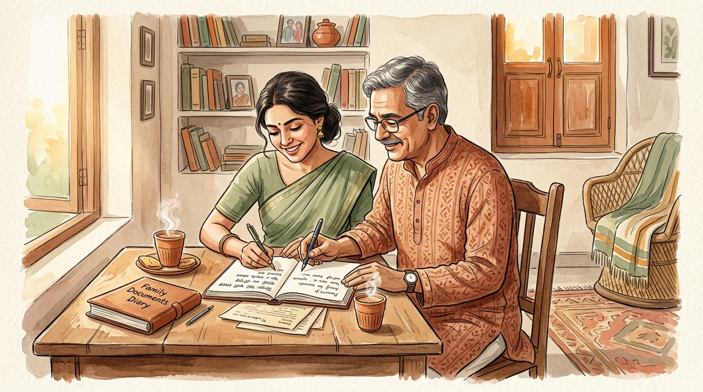
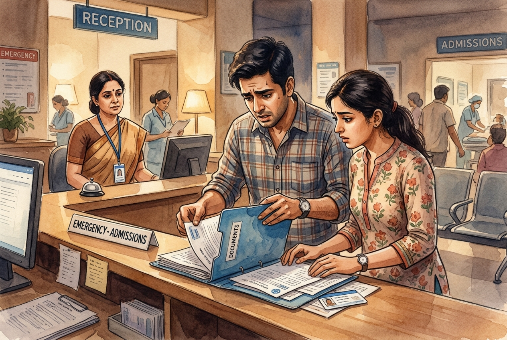
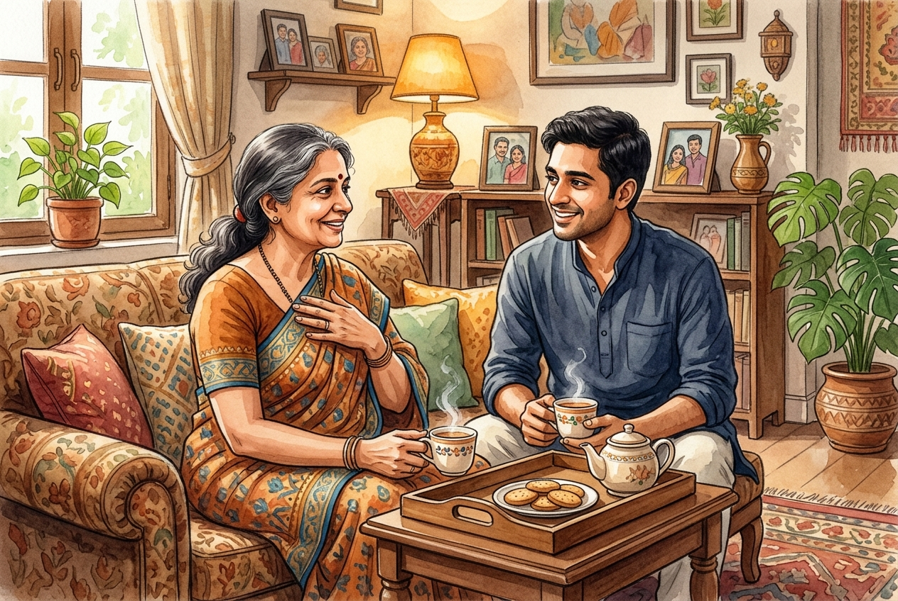
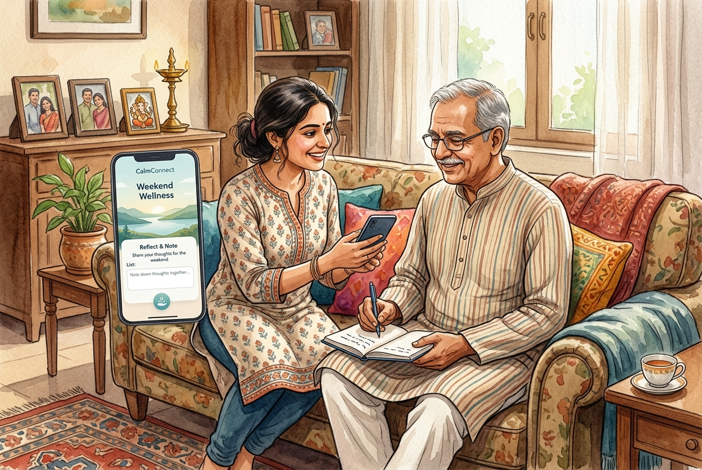
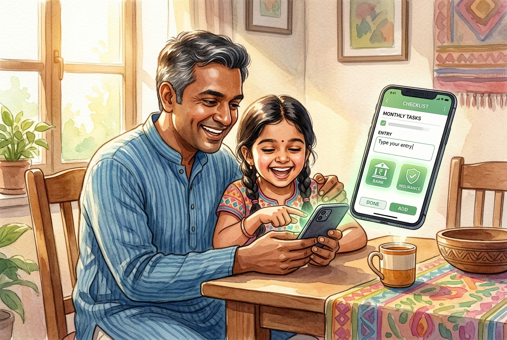
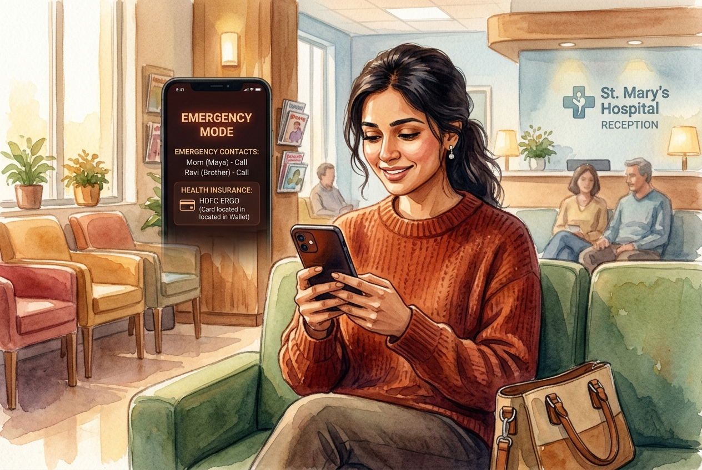
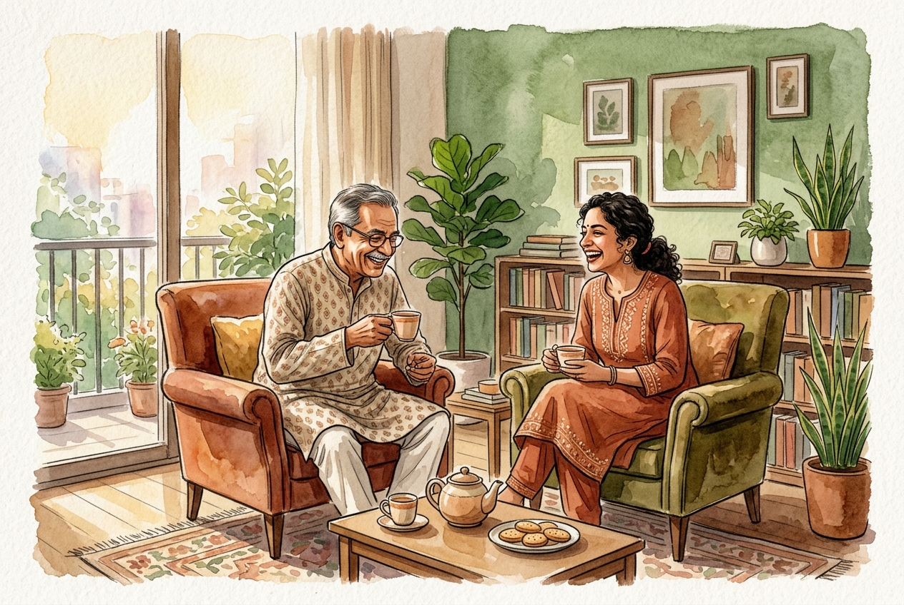

# SURELY 🗝️ — Know Where Everything Is

> **A Collaborative Family Financial & Document Memory Platform**  
> *The key to what your family already owns — documented calmly together before an emergency makes it urgent.*

[](https://surely-flax.vercel.app/)
[](#interactive-prototype)
[](#tech-stack--architecture)
[](#warm-ledger-design-system)
[](#getting-started)

> 🚀 **Live Demo:** Try the interactive prototype online at **[https://surely-flax.vercel.app/](https://surely-flax.vercel.app/)**

---

<div align="center">
  
  <p><em>"Twenty ordinary minutes over afternoon tea — replacing decades of anxiety with generational clarity."</em></p>
</div>

---

## 📑 Table of Contents

- [Executive Summary](#-executive-summary)
- [The Core Problem](#-the-core-problem)
  - [The Invisible Family Blindspot](#the-invisible-family-blindspot)
  - [Storyboard 1: The Problem Journey](#storyboard-1-the-problem-journey)
- [Market Opportunity & Sizing](#-market-opportunity--sizing)
- [Ideation & Concept Evaluation](#-ideation--concept-evaluation)
- [The SURELY Solution](#-the-surely-solution)
  - [Core Product Pillars](#core-product-pillars)
  - [Storyboard 2: The Solution Experience](#storyboard-2-the-solution-experience)
- [Interactive Prototype Architecture](#-interactive-prototype-architecture)
  - [Key User Flows & Screens](#key-user-flows--screens)
  - [Persona Switcher (Dual Perspectives)](#persona-switcher-dual-perspectives)
- [User Testing & Validation Findings](#-user-testing--validation-findings)
- ["Warm Ledger" Design System](#-warm-ledger-design-system)
- [Tech Stack & Architecture](#-tech-stack--architecture)
- [Getting Started](#-getting-started)
- [Innovation Story & Narrative Close](#-innovation-story--narrative-close)

---

## 🌟 Executive Summary

In millions of Indian households, life savings, insurance policies, bank lockers, and property deeds are scattered across rusted Godrej almirahs, old passbooks, and aging memory. 

**SURELY** is an empathetic, collaborative family financial memory platform designed for **ageing parents (55+)** and their **adult children (28–45)**. Unlike traditional fintech dashboards or complex estate-planning apps, Surely:

1. **Focuses on Location over Valuation:** Answers *"Where is it and who to call?"* rather than tracking daily market net worth.
2. **Preserves Parental Dignity:** Features sensitive value masking (`••••••`) so parents share existence without feeling surveilled or stripped of autonomy.
3. **Takes Under 60 Seconds per Entry:** Frictionless, conversational single-screen forms.
4. **Delivers Instant Emergency Mode:** A high-contrast, uncluttered screen built for crisis clarity at hospital admissions.

---

## 🔍 The Core Problem

### The Invisible Family Blindspot

Financial documents in Indian homes are invisible during peaceful times, but excruciatingly painful during medical hospitalizations, sudden strokes, or bereavement.

```
                  ┌────────────────────────────────────────┐
                  │        The Generational Dilemma        │
                  └───────────────────┬────────────────────┘
                                      │
           ┌──────────────────────────┴──────────────────────────┐
           ▼                                                     ▼
┌──────────────────────────────┐              ┌──────────────────────────────┐
│       Aging Parents (55+)    │              │     Adult Children (28-45)   │
├──────────────────────────────┤              ├──────────────────────────────┤
│ • "I might have an old FD    │              │ • Scramble at night during   │
│    I've forgotten about."    │              │   sudden hospital visits.    │
│ • Want children to know,     │              │ • Terrified of prying or     │
│   but fear losing autonomy.  │              │   appearing greedy.          │
└──────────────────────────────┘              └──────────────────────────────┘
```

> **"I'm not 100% sure I've listed everything. There could be an FD I opened decades ago that I've forgotten about."**  
> — *Suresh, 61, Father & Retired Teacher*

> **"After Papa's stroke, we found three passbooks, one closed account, and an insurance policy we didn't even know existed."**  
> — *Arjun, 33, Adult Child & Family Coordinator*

> **"I want my son to know where everything is, without it feeling like I'm handing over control before I'm ready to."**  
> — *Lata, 58, Mother & Home Record-keeper*

---

### Storyboard 1: The Problem Journey

| Panel 1 · Scattered Paperwork | Panel 2 · Emergency Scramble |
|:---:|:---:|
|  |  |
| **Decades of Savings Scattered:** Passbooks, physical certificates, and locker keys dispersed across drawers. | **The Midnight Scramble:** Children frantically searching for policy numbers & TPA cards at hospital desks. |

| Panel 3 · The Dignity Dilemma | Panel 4 · The Unclaimed Reality |
|:---:|:---:|
|  |  |
| **The Autonomy Paradox:** Parents want to share essential details, but fear losing dignity or control. | **₹78,213 Cr Orphaned:** Billions in life savings sit unclaimed in RBI DEAF vaults because families never knew. |

---

## 📊 Market Opportunity & Sizing

The convergence of senior population growth, rapid digitisation, and intergenerational wealth transfer creates a critical need for structured document memory.

```
┌────────────────────────────────────────────────────────────────────────┐
│                        Market Sizing Funnel                            │
├────────────────────────────────────────────────────────────────────────┤
│  TAM: ~100M–110M Households                                            │
│  [ Urban middle-class Indian households with multi-instrument savings ]│
│  ────────────────────────────────────────────────────────────────────  │
│  SAM: ~17M–18M Households                                              │
│  [ Digitally active families with senior parents & smartphone access ] │
│  ────────────────────────────────────────────────────────────────────  │
│  SOM (Year 3 Scale Target): 150,000–200,000 Households (~1% of SAM)  │
│  ────────────────────────────────────────────────────────────────────  │
│  SOM (Year 1 City Pilot): 5,000–10,000 Early Adopter Families          │
└────────────────────────────────────────────────────────────────────────┘
```

- **289 Million** Indian Households nationwide (2024).
- **153 Million** Senior Citizens (60+) in India.
- **₹78,213 Crore** Unclaimed Deposits in RBI's DEAF fund (+26% YoY increase).

---

## 💡 Ideation & Concept Evaluation

Five architectural concepts were evaluated across 8 distinct family segments against seven weighted criteria:

| Concept Candidate | Feasibility | Cost | User Impact | Adoption | Scalability | Risk | Build Time | Verdict |
|:---|:---:|:---:|:---:|:---:|:---:|:---:|:---:|:---|
| **A. Shared Family Memory App** | **4** | **4** | **5** | **4** | **5** | **3** | **4** | 🏆 **WINNER (Selected)** |
| **B. Human Concierge Service** | 2 | 2 | 4 | 5 | 1 | 2 | 3 | Rejected (High cost, low scale) |
| **C. Bank/Insurer Feature** | 2 | 5 | 2 | 3 | 2 | 2 | 2 | Rejected (Institutions won't index rivals) |
| **D. WhatsApp Bot Reminders** | 5 | 5 | 2 | 5 | 3 | 4 | 5 | Rejected (Too ephemeral for crisis retrieval) |
| **F. Insurer-Led Portal** | 3 | 4 | 2 | 3 | 3 | 1 | 3 | Rejected (Severe conflict of interest) |

> ### 🛑 Why Not a Will-Writing App? (Concept E Rejection)
> Will-writing demands legal finality and mortality confrontation that Indian families actively resist on Day 1. **SURELY** adopts the calm, neutral posture of a simple *"where are the keys and passbooks"* checklist, fostering trust first.

---

## 🌿 The SURELY Solution

### Core Product Pillars

```
                     ┌─────────────────────────────┐
                     │       SURELY PILLARS        │
                     └──────────────┬──────────────┘
         ┌──────────────────────────┼──────────────────────────┐
         ▼                          ▼                          ▼
┌──────────────────┐       ┌──────────────────┐       ┌──────────────────┐
│  Calm Ledger UI  │       │  Dignity Masking │       │  Emergency Mode  │
├──────────────────┤       ├──────────────────┤       ├──────────────────┤
│ Warm paper tones │       │ Rupee values     │       │ High-contrast,   │
│ and zero fintech │       │ shielded behind  │       │ 1-tap dialer for │
│ dashboard panic. │       │ lock chips.      │       │ critical triage. │
└──────────────────┘       └──────────────────┘       └──────────────────┘
```

---

### Storyboard 2: The Solution Experience

| Panel 1 · Weekend Invite | Panel 2 · 60-Second Guided Entry |
|:---:|:---:|
|  |  |
| **Casual Weekend Setup:** Ananya visits Suresh and suggests a 20-minute tea-time exercise. | **Fast, Frictionless Flow:** Adding essential accounts in under 60s; categories light up in sage green. |

| Panel 3 · Dignity & Privacy | Panel 4 · Calm in Crisis |
|:---:|:---:|
|  |  |
| **Masked Balance Privacy:** Suresh hides exact sums while Ananya gets policy locations and contact details. | **Instant Emergency Retrieval:** At the hospital desk, Ananya accesses TPA & policy numbers in 5 seconds. |

<div align="center">
  
  <p><strong>Panel 5 · Shared Peace of Mind:</strong> Generational trust restored without fear, clinical forms, or awkward friction.</p>
</div>

---

## 📱 Interactive Prototype Architecture

The project features a **fully interactive, zero-dependency mobile app shell** embedded right within the landing showcase.

```
                              ┌──────────────────────────┐
                              │  SURELY App Controller   │
                              └────────────┬─────────────┘
                                           │
         ┌─────────────────────────────────┼─────────────────────────────────┐
         ▼                                 ▼                                 ▼
┌──────────────────┐              ┌──────────────────┐              ┌──────────────────┐
│  Checklist Home  │              │ Category Detail  │              │  Emergency Mode  │
├──────────────────┤              ├──────────────────┤              ├──────────────────┤
│ • 8 Categories   │ ──(Select)─► │ • Item listing   │ ──(Alert)──► │ • Tap-to-call    │
│ • Progress Bar   │              │ • Masking toggle │              │ • Physical docs  │
│ • Completion Dot │ ◄──(Back)─── │ • "+ Add Entry"  │ ◄──(Exit)─── │ • TPA & Insurer  │
└──────────────────┘              └──────────────────┘              └──────────────────┘
         │
         ▼
┌──────────────────┐
│  Add Entry View  │
├──────────────────┤
│ • 5-field form   │
│ • Masking switch │
│ • Live save sync │
└──────────────────┘
```

### Key User Flows & Screens

1. **Screen 1 — Family Space Checklist (`#/home`):**
   - 8 core categories: *Bank Accounts, Insurance, PF/EPF, Property Papers, Locker & Gold, Digital Accounts, Investments, Other*.
   - Live progress indicator (e.g., 5 of 8 completed in seed state).
   - Card state flips dynamically from dashed *Empty* to illuminated *Complete*.
2. **Screen 2 — Category Detail (`#/category/:id`):**
   - Card list displaying institution, physical location, notes, and added-by badges.
   - **Interactive Masking Toggle:** Click the lock badge to seamlessly toggle between `••••••••` and full rupee amounts.
3. **Screen 3 — Guided Entry Creation (`#/add/:category`):**
   - Single-screen form designed to take < 60 seconds.
   - Immediate reactive update to the family completeness meter upon saving.
4. **Screen 4 — Calm Emergency Mode (`#/emergency`):**
   - Deep warm charcoal background (`#241C18`) for night readability.
   - Surfaces priority contacts (*Ananya*, *Dr. Kulkarni*) with simulated tap-to-call.
   - Curates critical physical document locations with zero financial clutter.

### Persona Switcher (Dual Perspectives)

Top bar toggle allows reviewers to switch between perspectives:
- **Ananya (Adult Child Coordinator):** Sees shared records and emergency triage views.
- **Suresh (Parent):** Demonstrates ease of input and dignity preservation.

---

## 🧪 User Testing & Validation Findings

Qualitative testing conducted with **13 family participants** across India revealed critical behavioral insights:

```
┌─────────────────────────────────┬─────────────────────────────────┐
│     01. WHAT WAS CONFIRMED      │     02. WHAT WAS CHALLENGED     │
├─────────────────────────────────┼─────────────────────────────────┤
│ • 85% of adult children harbor  │ • Death framing triggers acute  │
│   unspoken anxiety about        │   avoidance. "20 mins of tea-   │
│   emergency paperwork.          │   time organization" had 3x     │
│ • Information is scattered      │   higher adoption willingness.  │
│   across 5.2 institutions/home. │ • Users actively rejected auto  │
│                                 │   net-banking sync (too risky). │
├─────────────────────────────────┼─────────────────────────────────┤
│     03. WHAT SURPRISED US       │      04. WHAT WE CHANGED        │
├─────────────────────────────────┼─────────────────────────────────┤
│ • Value Masking is the core     │ • Replaced multi-step wizards   │
│   trust catalyst for parents.   │   with single-page 60s forms.   │
│ • Emergency Mode created the    │ • Designed the 8-category       │
│   strongest immediate "aha!".   │   checklist progress metaphor.  │
└─────────────────────────────────┴─────────────────────────────────┘
```

---

## 🎨 "Warm Ledger" Design System

Surely deliberately rejects the generic "AI startup" look (no dark neon, no purple-blue gradients, no cold glassmorphism). It adopts the tactile warmth of a cherished family diary.

### Color Tokens

| Token | Hex | Role |
|:---|:---:|:---|
| `--cream` | `#FBF6EE` | Canvas background |
| `--cream-warm` | `#F3E9D8` | Alternate section background |
| `--terracotta` | `#C66B4F` | Primary brand accent, CTAs, active states |
| `--terracotta-dark` | `#A85338` | Hover and pressed states |
| `--sage` | `#8A9A7E` | Secondary accent, complete checklist state |
| `--sage-dark` | `#5F6E54` | Typography on sage backgrounds |
| `--brown-ink` | `#3B2E28` | Primary reading text |
| `--brown-soft` | `#6B5C52` | Subtitles, secondary captions |
| `--gold-muted` | `#C9A15A` | Key accents, highlight tags |
| `--border-soft` | `#E4D9C6` | Subtle dividers and card outlines |

### Typography

- **Headings:** `Fraunces` & `Lora` — Warm, editorial humanist serifs.
- **UI & Body:** `Inter` & `Source Sans 3` — Clean, legible humanist sans.

---

## 💻 Tech Stack & Architecture

- **Core Technologies:** HTML5, Modern Vanilla CSS3, Vanilla JavaScript (ES6+).
- **Zero Build Tools:** No Webpack, Vite, npm, or Babel required. Runs out of the box in any modern browser.
- **State Management:** Reactive in-memory state store (`SurelyState`) with automatic fallback to `localStorage`.
- **Modular Component Structure:**

```
surely/
├── index.html                  # Single-page narrative & prototype entry
├── README.md                   # Complete documentation
├── SURELY_Website_Spec.md      # Full innovation website specification
├── surely-prototype-spec.md    # Prototype interaction specification
├── img/                        # High-resolution generated imagery
│   ├── hero-cover.jpg          # Hero artwork
│   ├── storyboard-1-panel-1.jpg# Problem S1·P1
│   ├── storyboard-1-panel-2.jpg# Problem S1·P2
│   ├── storyboard-1-panel-3.jpg# Problem S1·P3
│   ├── storyboard-1-panel-4.jpg# Problem S1·P4
│   ├── storyboard-2-panel-1.jpg# Solution S2·P1
│   ├── storyboard-2-panel-2.jpg# Solution S2·P2
│   ├── storyboard-2-panel-3.jpg# Solution S2·P3
│   ├── storyboard-2-panel-4.jpg# Solution S2·P4
│   ├── storyboard-2-panel-5.jpg# Solution S2·P5
│   └── closing-hands.jpg       # Closing story artwork
├── styles/
│   ├── main.css                # Design system tokens, typography, grid
│   ├── views.css               # Marketing narrative, quotes, TAM funnel
│   └── components.css          # Mobile mock frame, checklist cards, buttons
└── js/
    ├── app.js                  # App bootstrap & event wiring
    ├── state.js                # In-memory reactive state manager
    ├── prototype.js            # Mock phone UI renderer & view coordinator
    ├── story.js                # Scroll observers & interactive guide steps
    ├── icons.js                # Inline SVG icon generator
    ├── components/             # Reusable UI widgets (toast, header, guide)
    └── views/                  # Screen view templates (home, add, emergency, etc.)
```

---

## 🚀 Getting Started

### Option 1: Try Online (Instant)
Access the live deployment directly in your browser:
👉 **[https://surely-flax.vercel.app/](https://surely-flax.vercel.app/)**

### Option 2: Run Locally
To run the Surely showcase and prototype locally:

1. **Clone or Navigate to the Repository:**
   ```bash
   cd surely
   ```

2. **Open in Browser:**
   - Double-click `index.html` directly in your file explorer, **OR**
   - Serve using any static HTTP server:
     ```bash
     # Python 3
     python -m http.server 8000
     
     # Node.js (npx)
     npx serve .
     ```

3. **Explore the Demo:**
   - Scroll through the innovation story, market sizing, and user validation.
   - Interact with the phone frame in the **Prototype Demo** section.
   - Click **Reset Seed** at any time to restore the initial state.

---

## 📖 Innovation Story & Narrative Close

<div align="center">
  
  
  <br/><br/>
  
  <blockquote style="font-size: 1.25rem; font-style: italic; color: #3B2E28; max-width: 650px;">
    "It didn't need a crisis. It needed twenty ordinary minutes."
  </blockquote>
  
  <p style="color: #6B5C52; font-size: 0.95rem;">
    The key to what your family already owns — kept safely, together.
  </p>
</div>

---

<div align="center">
  <sub>Built for the MBA Innovation & Design Thinking Project · 2026</sub>
</div>
